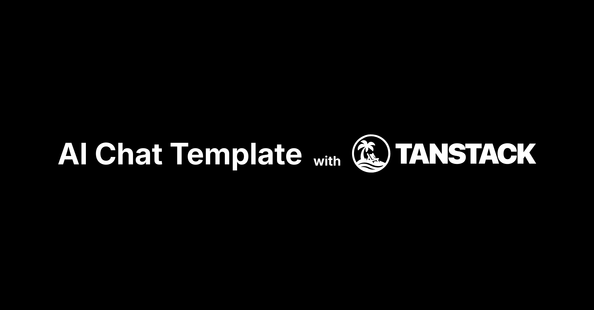

<h1 align="center">Chat SDK (TanStack Edition)</h1>

<p align="center">
    Chat SDK is a free, open-source template built with <a href="https://tanstack.com/start/latest">TanStack Start</a> and the <a href="https://sdk.vercel.ai/docs">AI SDK</a> that helps you quickly build powerful chatbot applications.
</p>

<p align="center">
    <em>This project is a fork of <a href="https://github.com/vercel/ai-chatbot">vercel/ai-chatbot</a>, adapted for the TanStack ecosystem.</em>
</p>

<p align="center">
  <a href="#features"><strong>Features</strong></a> ·
  <a href="#planned-features"><strong>Planned Features</strong></a> ·
  <a href="#model-providers"><strong>Model Providers</strong></a> ·
  <a href="#deploy-your-own"><strong>Deploy Your Own</strong></a> ·
  <a href="#running-locally"><strong>Running locally</strong></a>
</p>
<br/>

## Features

- [TanStack Start](https://tanstack.com/start/latest)
  - Full-stack React framework with server-side rendering and streaming
- [TanStack Router](https://tanstack.com/router/latest)
  - 100% type-safe routing for React
- [TanStack Query](https://tanstack.com/query/latest)
  - Powerful asynchronous state management
- [TanStack Form](https://tanstack.com/form/latest)
  - Headless, type-safe form management
- [AI SDK](https://sdk.vercel.ai/docs)
  - Unified API for generating text, structured objects, and tool calls with LLMs
  - Hooks for building dynamic chat and generative user interfaces
  - Supports xAI (default), OpenAI, Fireworks, and other model providers
- [shadcn/ui](https://ui.shadcn.com)
  - Styling with [Tailwind CSS](https://tailwindcss.com)
  - Component primitives from [Radix UI](https://radix-ui.com) for accessibility and flexibility
- Data Persistence
  - [Drizzle ORM](https://orm.drizzle.team/) with Postgres (e.g., [Neon](https://neon.tech)) for saving chat history and user data
  - [Vercel Blob](https://vercel.com/storage/blob) for efficient file storage
- [Better Auth](https://www.better-auth.com/)
  - Comprehensive and secure authentication

## Planned Features

- **Migrate to TanStack AI**: When the [TanStack AI package](https://tanstack.com/ai/latest) becomes stable enough, we plan to migrate from the Vercel AI SDK to maintain consistency with the TanStack ecosystem.

## Model Providers

This template uses the [Vercel AI Gateway](https://vercel.com/docs/ai-gateway) to access multiple AI models through a unified interface. The default configuration includes [xAI](https://x.ai) models (`grok-2-vision-1212`, `grok-3-mini`) routed through the gateway.

### AI Gateway Authentication

**For Vercel deployments**: Authentication is handled automatically via OIDC tokens.

**For non-Vercel deployments**: You need to provide an AI Gateway API key by setting the `AI_GATEWAY_API_KEY` environment variable in your `.env` file.

With the [AI SDK](https://sdk.vercel.ai/docs), you can also switch to direct LLM providers like [OpenAI](https://openai.com), [Anthropic](https://anthropic.com), [Cohere](https://cohere.com/), and [many more](https://sdk.vercel.ai/providers/ai-sdk-providers) with just a few lines of code.

## Deploy Your Own

You can deploy your own version of this Chatbot to Vercel.

[](https://vercel.com/new/clone?repository-url=https://github.com/osadavc/tanchat)

## Running locally

You will need to use the environment variables [defined in `.env.example`](.env.example) to run the chatbot.

> Note: You should not commit your `.env` file or it will expose secrets that will allow others to control access to your various AI and authentication provider accounts.

1. Install dependencies:

```bash
pnpm install
```

2. Setup the database:

```bash
pnpm run db:migrate
```

3. Start the development server:

```bash
pnpm run dev
```

Your app template should now be running on [localhost:3000](http://localhost:3000).
